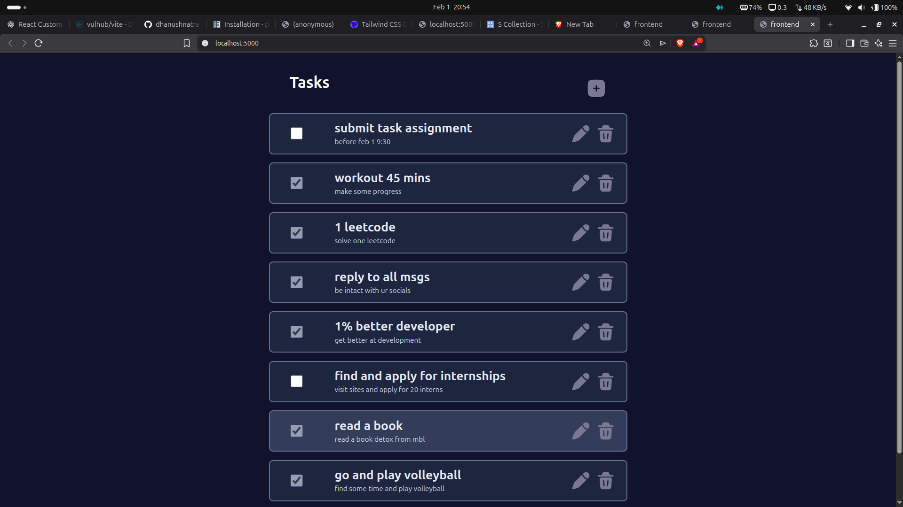
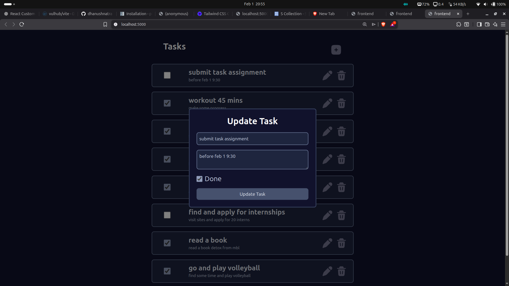
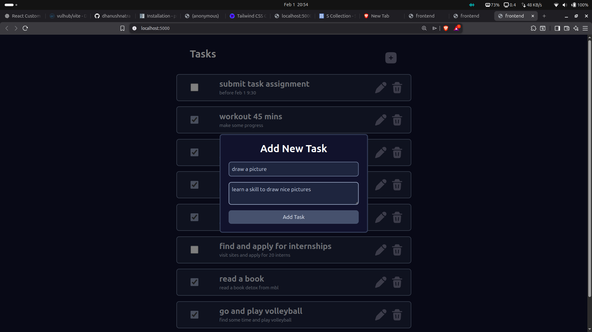

# task assignment

CRUD tasks

## UI - Showcase

<div style="display:flex;flex-direction:row;gap:12px">



</div>

## tech involved

- python (flask)
- javascript (react)
- css (tailwind)
- db (mysql)

## Prequesties

- docker
- nodejs (optional - developement)

## installation

- run docker containers
    ```
    docker compose up --build
    ```
- go to [this link](http://localhost:5000/) to view the site

## Uninstallation

- remove by using
    ```
    docker compose down \
    docker volumes rm -f tasks_assignment_mysql_data
    ```

## build urself

**Note:you need node to proceed these steps**

- ### linux

    ```
    cd frontend \
    ./build.sh
    ```

    - do the following [installation](#installation)

- ## windows

    ```
    cd frontend && npm install
    ```

    - move all the contents inside dist or build files to backend/static (replace if exists)
    - then do the following [installation](#installation)

## Reach me : dhanushnatra2@gmail.com

**Happy Coding 😁**
